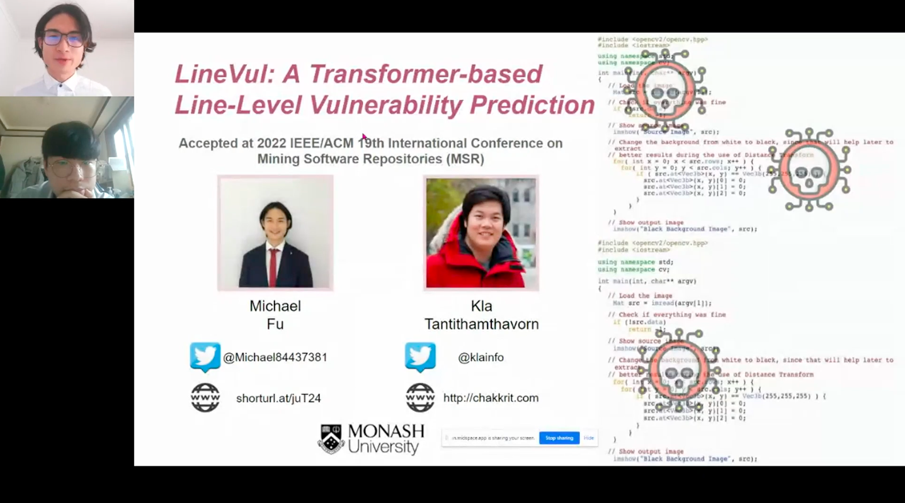

# LineVul Replication Package
<!-- PROJECT LOGO -->
<br />
<p align="center">
    
  </a>
  <h3 align="center">LineVul</h3>
  <p align="center">
    A Transformer-based Line-Level Vulnerability Prediction Approach
  </p>
</p>

## Predict Real-World Software Vulnerabilities
<div align="center">

<h3>
    <b>
        LineVul Performance on <a href="https://cwe.mitre.org/top25/archive/2021/2021_cwe_top25.html">Top-25 Most Dangerous CWEs in 2021</a>
    </b>
</h3>

| Rank | CWE Type |  TPR | Proportion |
|:----:|:--------:|:----:|:----------:|
|   1  |  CWE-787 |  75% |    18/24   |
|   2  |  CWE-79  |   -  |      -     |
|   3  |  CWE-125 |   -  |      -     |
|   4  |  CWE-20  |  86% |   98/114   |
|   5  |  CWE-78  |   -  |      -     |
|   6  |  CWE-89  |   -  |      -     |
|   7  |  CWE-416 |   -  |      -     |
|   8  |  CWE-22  | 100% |     4/4    |
|   9  |  CWE-352 |   -  |      -     |
|  10  |  CWE-434 |   -  |      -     |
|  11  |  CWE-306 |   -  |      -     |
|  12  |  CWE-190 |  90% |    27/30   |
|  13  |  CWE-502 |   -  |      -     |
|  14  |  CWE-287 |   -  |      -     |
|  15  |  CWE-476 |   -  |      -     |
|  16  |  CWE-798 |   -  |      -     |
|  17  |  CWE-119 |  88% |   173/197  |
|  18  |  CWE-862 |   -  |      -     |
|  19  |  CWE-276 |   -  |      -     |
|  20  |  CWE-200 |  85% |    45/53   |
|  21  |  CWE-522 |   -  |      -     |
|  22  |  CWE-732 |   -  |      -     |
|  23  |  CWE-611 |   -  |      -     |
|  24  |  CWE-918 |   -  |      -     |
|  25  |  CWE-77  | 100% |     2/2    |
    
<h3>
    <b>
        Top-10 Most Accurately Predicted CWE Types of LineVul  
    </b>
</h3>

| Rank | CWE Type |  TPR | Proportion |
|:----:|:--------:|:----:|:----------:|
|   1  |  CWE-284 | 100% |    11/11   |
|   2  |  CWE-269 | 100% |     8/8    |
|   3  |  CWE-254 | 100% |     6/6    |
|   4  |  CWE-415 | 100% |     6/6    |
|   5  |  CWE-311 | 100% |     4/4    |
|   6  |  CWE-22  | 100% |     4/4    |
|   7  |  CWE-17  | 100% |     4/4    |
|   8  |  CWE-617 | 100% |     4/4    |
|   9  |  CWE-358 | 100% |     3/3    |
|  10  |  CWE-285 | 100% |     3/3    |

</div>

<div align="center">
    <h3>
    <b>
        [MSR 2022 Technical track] [Paper #166] [7 mins talk] LineVul: Line-Level Vulnerability Prediction 
    </b>
</h3>
    <a href="https://www.youtube.com/watch?v=m9bWIiDe-fU"></a>
</div>
    
<!-- Table of contents -->
<details open="open">
  <summary>Table of Contents</summary>
  <ol>
    <li>
      <a href="#how-to-replicate">How to replicate</a>
        <ul>
          <li><a href="#about-the-environment-setup">About the Environment Setup</a></li>
          <li><a href="#about-the-datasets">About the Datasets</a></li>
          <li><a href="#about-the-models">About the Models</a></li>
          <li><a href="#about-the-experiment-replication">About the Experiment Replication</a></li>
        </ul>
    </li>
    <li>
      <a href="#appendix">Appendix</a>
    </li>
    <li>
      <a href="#acknowledgements">Acknowledgements</a>
    </li>
    <li>
      <a href="#license">License</a>
    </li>
    <li>
      <a href="#citation">Citation</a>
    </li>
  </ol>
</details>

## How to replicate 

### About the Environment Setup
First of all, clone this repository to your local machine and access the main dir via the following command:
```
git clone https://github.com/anon-ai-research/LineVul.git
cd LineVul
```

Then, install the python dependencies via the following command:
```
pip install gdown
pip install transformers
pip install captum
pip install torch
pip install numpy
pip install tqdm
pip install pickle
pip install sklearn
pip install pandas
pip install tokenizers
```

### About the Datasets
All of the dataset has the same number of columns (i.e., 39 cols), we focus on the following 3 columns to conduct our experiments:
1. processed_func (str): The original function written in C/C++
2. target (int): The function-level label that determines whether a function is vulnerable or not
3. vul_func_with_fix (str): The fixed function with added in deleted lines labeled

<div align="center">

processed_func | target | vul_func_with_fix 
| :---: | :---: | :---:
...  | ... | ... 

</div>
    
For more information of our dataset, please refer to <a href="https://dl.acm.org/doi/10.1145/3379597.3387501">this paper</a> and <a href="https://github.com/ZeoVan/MSR_20_Code_vulnerability_CSV_Dataset">this repository</a>.

### About the Models

#### Model Naming Convention
All of the models in the Google Drive are named based on the convention described in the following table:

Model Name | Model Specification 
| :---: | :---: 
LineVul  | BPE Tokenizer + Pre-training (Codesearchnet) + BERT 
BPEBERT  | BPE Tokenizer + No Pre-training + BERT 
WordlevelPretrainedBERT  | Wordlevel Tokenizer + Pre-training (Codesearchnet) + BERT 
WordlevelBERT | Wordlevel Tokenizer + No Pre-training + BERT 

#### How to access the models
* All of the models included in our experiments can be downloaded from public Google Drive.

### About the Experiment Replication  
  We provide a csv file that contains all of the raw function-level predictions by LineVul, run the following commands to download:
  ```
  cd linevul
  cd results
  gdown https://drive.google.com/uc?id=1WqvMoALIbL3V1KNQpGvvTIuc3TL5v5Q8
  cd ../..
  ```
  
  We recommend to use **GPU with 8 GB up memory** for training since **BERT architecture is very computing intensive**. 
  
  Note. If the specified batch size is not suitable for your device, 
  please modify **--eval_batch_size** and **--train_batch_size** to **fit your GPU memory.**
  
  Before replicating the experiment results, please download the dataset as described below, if you want to **retrain the model**, you need to **download training, evaluation, and testing dataset.** If you just need to **reproduce the results (inference only)**, then **downloading testing dataset** alone is enough.
  
  To download the testing dataset used for evaluation in our experiments, run the following commands:
  ```
  cd data
  cd big-vul_dataset
  gdown https://drive.google.com/uc?id=1h0iFJbc5DGXCXXvvR6dru_Dms_b2zW4V
  cd ../..
  ```
  
  To download the training and evaluation dataset used for evaluation in our experiments, run the following commands:
  ```
  cd data
  cd big-vul_dataset
  gdown https://drive.google.com/uc?id=1ldXyFvHG41VMrm260cK_JEPYqeb6e6Yw
  gdown https://drive.google.com/uc?id=1yggncqivMcP0tzbh8-8Eu02Edwcs44WZ
  cd ../..
  ```
    
  To download the whole (i.e., train+val+test) unsplit dataset dataset, run the following commands:
  ```
  cd data
  cd big-vul_dataset
  gdown https://drive.google.com/uc?id=10-kjbsA806Zdk54Ax8J3WvLKGTzN8CMX
  cd ../..
  ```   
    
#### How to replicate RQ1
  Please first download the model "12heads_linevul_model.bin" through the following commands:
  ```
  cd linevul
  cd saved_models
  cd checkpoint-best-f1
  gdown https://drive.google.com/uc?id=1oodyQqRb9jEcvLMVVKILmu8qHyNwd-zH
  cd ../../..
  ```
  
  To reproduce the RQ1 result, run the following commands (Inference only):
  ```
  cd linevul
  python linevul_main.py \
    --model_name=12heads_linevul_model.bin \
    --output_dir=./saved_models \
    --model_type=roberta \
    --tokenizer_name=microsoft/codebert-base \
    --model_name_or_path=microsoft/codebert-base \
    --do_test \
    --train_data_file=../data/big-vul_dataset/train.csv \
    --eval_data_file=../data/big-vul_dataset/val.csv \
    --test_data_file=../data/big-vul_dataset/test.csv \
    --block_size 512 \
    --eval_batch_size 512
  ```
    
  To retrain the RQ1 model, run the following commands (Training + Inference):
  ```
  cd linevul
  python linevul_main.py \
    --output_dir=./saved_models \
    --model_type=roberta \
    --tokenizer_name=microsoft/codebert-base \
    --model_name_or_path=microsoft/codebert-base \
    --do_train \
    --do_test \
    --train_data_file=../data/big-vul_dataset/train.csv \
    --eval_data_file=../data/big-vul_dataset/val.csv \
    --test_data_file=../data/big-vul_dataset/test.csv \
    --epochs 10 \
    --block_size 512 \
    --train_batch_size 16 \
    --eval_batch_size 16 \
    --learning_rate 2e-5 \
    --max_grad_norm 1.0 \
    --evaluate_during_training \
    --seed 123456  2>&1 | tee train.log
  ```
  
  To reproduce the RQ1 result of BoW+RF, run the following commands:
  ```
  cd bow_rf
  mkdir saved_models
  python rf_main.py
  ```
    
#### How to replicate RQ2
  Please first download the model "12heads_linevul_model.bin" through the following commands:
  ```
  cd linevul
  cd saved_models
  cd checkpoint-best-f1
  gdown https://drive.google.com/uc?id=1oodyQqRb9jEcvLMVVKILmu8qHyNwd-zH
  cd ../../..
  ```
  
  To reproduce the RQ2 result of Top-10 Accuracy and IFA, run the following commands:
  ```
  cd linevul
  python linevul_main.py \
    --model_name=12heads_linevul_model.bin \
    --output_dir=./saved_models \
    --model_type=roberta \
    --tokenizer_name=microsoft/codebert-base \
    --model_name_or_path=microsoft/codebert-base \
    --do_test \
    --do_local_explanation \
    --top_k_constant=10 \
    --reasoning_method=all \
    --train_data_file=../data/big-vul_dataset/train.csv \
    --eval_data_file=../data/big-vul_dataset/val.csv \
    --test_data_file=../data/big-vul_dataset/test.csv \
    --block_size 512 \
    --eval_batch_size 512
  ```
    
  To reproduce the RQ2 result of Top-10 Accuracy and IFA of CppCheck, run the following commands:
  ```
  cd cppcheck
  python run.py
  ```
  
  Note. To install CppCheck, run the following command:
  ```
  sudo apt-get install cppcheck
  ```
  For more information about CppCheck, click <a href="https://cppcheck.sourceforge.io/">here</a>
    
#### How to replicate RQ3
  Please first download the model "12heads_linevul_model.bin" through the following commands:
  ```
  cd linevul
  cd saved_models
  cd checkpoint-best-f1
  gdown https://drive.google.com/uc?id=1oodyQqRb9jEcvLMVVKILmu8qHyNwd-zH
  cd ../../..
  ```
  
  To reproduce the RQ3 result of Effort@20%Recall and Recall@1%LOC, run the following commands:
  ```
  cd linevul
  python linevul_main.py \
    --model_name=12heads_linevul_model.bin \
    --output_dir=./saved_models \
    --model_type=roberta \
    --tokenizer_name=microsoft/codebert-base \
    --model_name_or_path=microsoft/codebert-base \
    --do_test \
    --do_sorting_by_line_scores \
    --effort_at_top_k=0.2 \
    --top_k_recall_by_lines=0.01 \
    --top_k_recall_by_pred_prob=0.2 \
    --reasoning_method=all \
    --train_data_file=../data/big-vul_dataset/train.csv \
    --eval_data_file=../data/big-vul_dataset/val.csv \
    --test_data_file=../data/big-vul_dataset/test.csv \
    --block_size 512 \
    --eval_batch_size 512
  ```

  To reproduce the RQ3 result of Effort@20%Recall and Recall@1%LOC of CppCheck, run the following commands:
  ```
  cd cppcheck
  python run.py
  ```
  
  Note. To install CppCheck, run the following command:
  ```
  sudo apt-get install cppcheck
  ```
  For more information about CppCheck, click <a href="https://cppcheck.sourceforge.io/">here</a>

#### How to replicate the ablation study in the discussion section
  Please first download the model "12heads_linevul_model.bin" through the following commands:
  ```
  cd linevul
  cd saved_models
  cd checkpoint-best-f1
  gdown https://drive.google.com/uc?id=1oodyQqRb9jEcvLMVVKILmu8qHyNwd-zH
  cd ../../..
  ```
  
  To reproduce the result of LineVul model in the ablation study, run the following commands:
  ```
  cd linevul
  python linevul_main.py \
    --model_name=12heads_linevul_model.bin \
    --output_dir=./saved_models \
    --model_type=roberta \
    --tokenizer_name=microsoft/codebert-base \
    --model_name_or_path=microsoft/codebert-base \
    --do_test \
    --train_data_file=../data/big-vul_dataset/train.csv \
    --eval_data_file=../data/big-vul_dataset/val.csv \
    --test_data_file=../data/big-vul_dataset/test.csv \
    --block_size 512 \
    --eval_batch_size 512
  ```

  Please first download the model "bpebert.bin" through the following commands:
  ```
  cd linevul
  cd saved_models
  cd checkpoint-best-f1
  gdown https://drive.google.com/uc?id=1uABZ8lurt7YMI-3bgxH8qLbm0jWANNoo
  cd ../../..
  ```

  To reproduce the result of "BPE+No Pretraining+BERT" model in the ablation study, run the following commands:
  ```
  cd linevul
  python linevul_main.py \
    --model_name=bpebert.bin \
    --output_dir=./saved_models \
    --model_type=roberta \
    --tokenizer_name=microsoft/codebert-base \
    --model_name_or_path=microsoft/codebert-base \
    --do_test \
    --train_data_file=../data/big-vul_dataset/train.csv \
    --eval_data_file=../data/big-vul_dataset/val.csv \
    --test_data_file=../data/big-vul_dataset/test.csv \
    --block_size 512 \
    --eval_batch_size 512
  ```
  
  Please first download the model "WordlevelPretrainedBERT.bin" through the following commands:
  ```
  cd linevul
  cd saved_models
  cd checkpoint-best-f1
  gdown https://drive.google.com/uc?id=1cXeaWeBCpBuY6gPkRft2tS7SnDZrBed-
  cd ../../..
  ```
  
  To reproduce the result of "Word-Level+Pretraining(Codesearchnet)+BERT" model in the ablation study, run the following commands:
  ```
  cd linevul
  python linevul_main.py \
    --model_name=WordlevelPretrainedBERT.bin \
    --output_dir=./saved_models \
    --model_type=roberta \
    --tokenizer_name=microsoft/codebert-base \
    --model_name_or_path=microsoft/codebert-base \
    --do_test \
    --train_data_file=../data/big-vul_dataset/train.csv \
    --eval_data_file=../data/big-vul_dataset/val.csv \
    --test_data_file=../data/big-vul_dataset/test.csv \
    --block_size 512 \
    --eval_batch_size 512
  ```
    
  Please first download the model "WordlevelBERT.bin" through the following commands:
  ```
  cd linevul
  cd saved_models
  cd checkpoint-best-f1
  gdown https://drive.google.com/uc?id=1yTe42JK_Z5ZB9MHb4eIKIMu-uqH0fE_m
  cd ../../..
  ```
    
  To reproduce the result of "Word-Level+No Pretraining+BERT" model in the ablation study, run the following commands:
  ```
  cd linevul
  python linevul_main.py \
    --model_name=WordlevelBERT.bin \
    --output_dir=./saved_models \
    --model_type=roberta \
    --tokenizer_name=microsoft/codebert-base \
    --model_name_or_path=microsoft/codebert-base \
    --do_test \
    --train_data_file=../data/big-vul_dataset/train.csv \
    --eval_data_file=../data/big-vul_dataset/val.csv \
    --test_data_file=../data/big-vul_dataset/test.csv \
    --block_size 512 \
    --eval_batch_size 512
  ```
## Appendix

<div align="center">

<h3>
    <b>
            Results of RQ1
    </b>
</h3>

|      Model     |  F1  | Precision | Recall |
|:--------------:|:----:|:---------:|:------:|
|     LineVul    | 0.91 |    0.97   |  0.86  |
|    IVDetect    | 0.35 |    0.23   |  0.72  |
|     Reveal     |  0.3 |    0.19   |  0.74  |
|     SySeVR     | 0.27 |    0.15   |  0.74  |
|     Devign     | 0.26 |    0.18   |  0.52  |
|     BoW+RF     | 0.25 |    0.48   |  0.17  |
| Russell et al. | 0.24 |    0.16   |  0.48  |
|  VulDeePecker  | 0.19 |    0.12   |  0.49  | 

<h3>
    <b>
            Results of RQ2
    </b>
</h3>

|           Model           | Top-10(lines) Accuracy | Top-1 Accuracy | Top-3 Accuracy | Top-5 Accuracy | Initial False Alarm |
|:-------------------------:|:----------------------:|:--------------:|:--------------:|:--------------:|:-------------------:|
|       Self Attention      |          0.65          |       0.1      |      0.31      |      0.46      |         4.56        |
| Layer Integrated Gradient |          0.53          |      0.09      |      0.22      |      0.36      |         8.31        |
|          Saliency         |          0.58          |      0.06      |      0.21      |      0.36      |         6.93        |
|          DeepLift         |          0.57          |      0.08      |      0.23      |      0.35      |         6.27        |
|        DeepLiftShap       |          0.57          |      0.08      |      0.23      |      0.35      |         6.26        |
|        GradientShap       |          0.52          |      0.08      |      0.24      |      0.34      |         7.82        |
|          CppCheck         |          0.15          |      0.07      |      0.09      |      0.12      |         21.6        |
    
<h3>
    <b>
            Results of RQ3
    </b>
</h3>

|           Model           | Effort@20%Recall | Recall@1%loc |
|:-------------------------:|:----------------:|:------------:|
|       Self Attention      |      0.0075      |     0.24     |
| Layer Integrated Gradient |      0.0106      |     0.19     |
|          Saliency         |      0.0151      |     0.13     |
|          DeepLift         |      0.0151      |     0.13     |
|        DeepLiftShap       |      0.0151      |     0.13     |
|        GradientShap       |       0.016      |     0.13     |
|          CppCheck         |       0.13       |     0.04     |
    
<h3>
    <b>
            Ablation Study Results of LineVul
    </b>
</h3>

|                   Model                   |  F1  | Precision | Recall |
|:-----------------------------------------:|:----:|:---------:|:------:|
| LineVul (BPE+Pre-training on Code + BERT) | 0.91 |    0.97   |  0.86  |
|        BPE + No Pre-training + BERT       | 0.80 |    0.86   |  0.75  |
|  Word-level + Pre-training on Code + BERT | 0.42 |    0.55   |  0.34  |
|    Word-level + No Pre-training + BERT    | 0.39 |    0.43   |  0.36  |
|                  IVDetect                 | 0.35 |    0.23   |  0.72  |

</div> 


## Acknowledgements
* Special thanks to CodeBERT's developers
* Special thanks to BigVulDataset Provider
* Special thanks to developers from PyTorch and HuggingFace for providing amazing frameworks to the community
  
## License 
<a href="https://github.com/awsm-research/LineVul/blob/main/LICENSE">MIT License</a>

## Citation
```bash
@inproceedings{fu2022linevul,
  title={LineVul: A Transformer-based Line-Level Vulnerability Prediction},
  author={Fu, Michael and Tantithamthavorn, Chakkrit},
  booktitle={2022 IEEE/ACM 19th International Conference on Mining Software Repositories (MSR)},
  year={2022},
  organization={IEEE}
}
```
